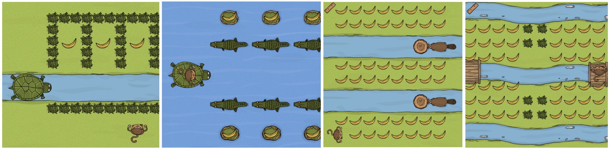
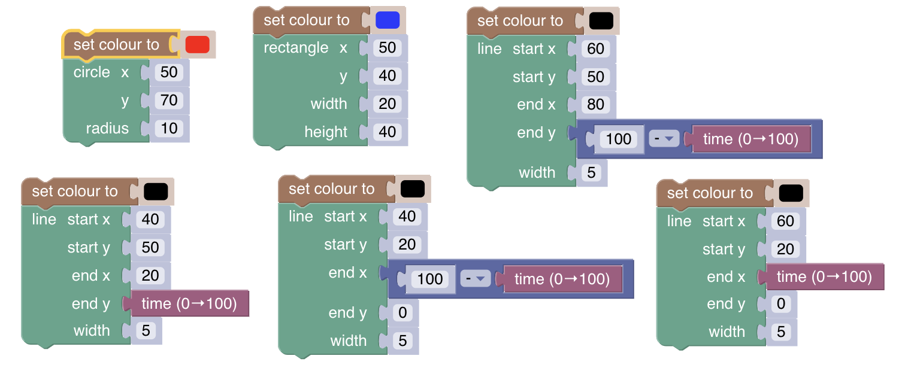
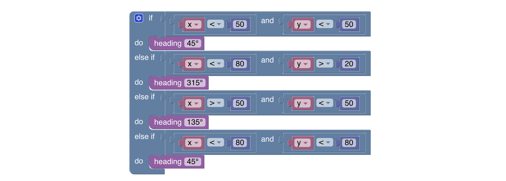
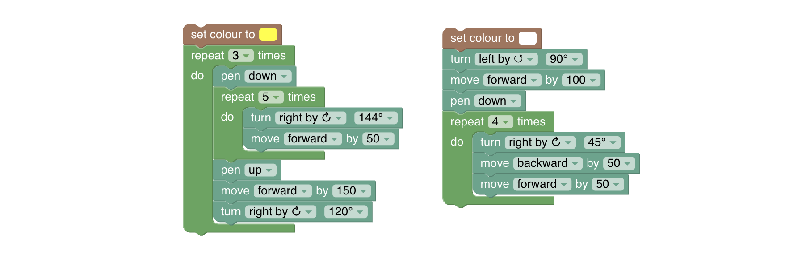

# SD2 Milestone Test 4

Welcome to SD2 Milestone Test 4 main page. You will be tested based on what you've learned in the previous meetings. 
Your subject for today's test are Code Monkey and Blockly. The test consist of two parts; Project and Debug.

## Project
For your Project test, your mission is to get all the bananas in every maze. **Please use all the given commands properly.**
To proceed, please follow these links:

### Project - Challenge 1
https://tinyurl.com/newMilestoneSD2-4-1 

### Project - Challenge 2
https://tinyurl.com/newMilestoneSD2-4-2

### Project - Challenge 3
https://tinyurl.com/newMilestoneSD2-4-3

### Project - Challenge 4
https://tinyurl.com/newMilestoneSD2-4-4

## Debug
For your Debug test, please remake the given codes below on the given Blockly challenges. Spot the mistakes, and fix the bug.

### Debug - Challenge 1
https://blockly-games.appspot.com/movie?lang=en&level=4

### Debug - Challenge 2
https://blockly-games.appspot.com/bird?lang=en&level=8

### Debug - Challenge 3
https://blockly-games.appspot.com/turtle?lang=en&level=7

## GOOD LUCK
